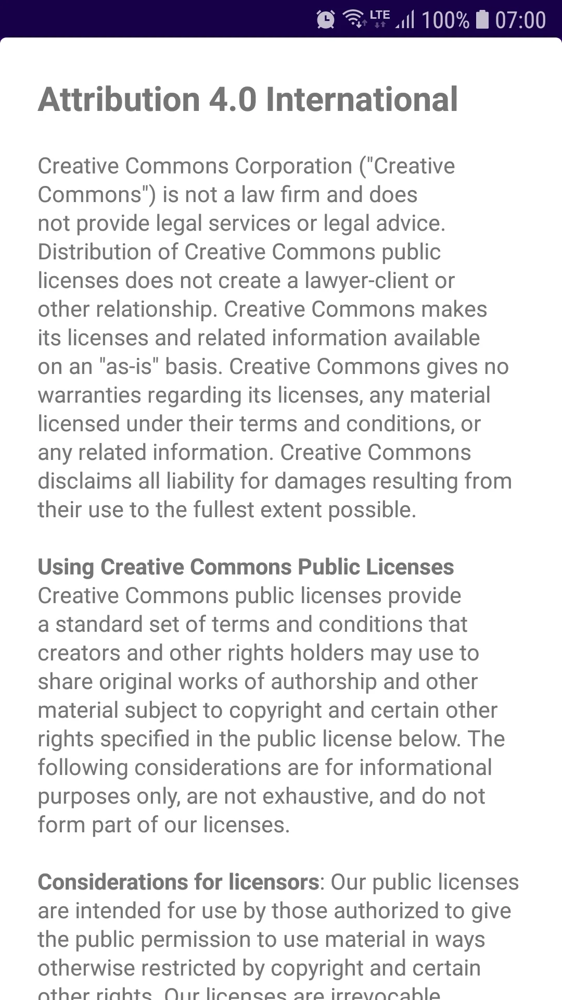

# Android Licenses Library
[](https://android-arsenal.com/api?level=1)
[](https://jitpack.io/#cyb3rko/about-icons)
[](https://github.com/cyb3rko/about-icons/commits/master)
[](https://www.gnu.org/licenses/gpl-3.0.html)

- [About this project](#about-this-project)  
- [Features](#feature)  
- [How to use](#how-to-use)  
- [Screenshots](#screenshots)  
- [Contribute](#contribute)  
- [Apps using this library](#apps--libraries-using-this-library)  
- [License](#license)  

---

## About this project
This lightweight Android library provides the most common licenses in formatted and plain text (as [Spanned object](https://developer.android.com/reference/android/text/Spanned)) for easy use.

YOU CAN **DOWNLOAD** THE **SAMPLE APP** [HERE](https://github.com/cyb3rko/android-licenses-library/raw/master/.github//Sample%20App/AndroidLicensesSample%20v1.0.0.apk)

I'm still a student so the progress might not be as fast as on other projects.

## Feature
providing you the most common licenses in formatted and plain text form as Spanned objects

## How to use

### 1. Implementation
Add this to your **root** build.gradle file:
```gradle
allprojects {
  repositories {
    maven { url "https://jitpack.io" }
  }
}
```

Then add this to your **module's** build.gradle file:
```gradle
dependencies {
  implementation 'com.github.cyb3rko:android-licenses-library:lastest-version'
}
```

### 2. Initialize AndroidLicenses
```kotlin
AndroidLicenses.init(applicationContext)
```

### 3. Get Spanned Object
The method `get(licenseName)` needs the license name as a parameter and returns a Spanned object.  
As the parameter you should use the predefined constants of `AndroidLicenses` class (which also show, which licenses are currently available):
- APACHE_2_0 / APACHE_2_0_PLAIN
- CC_BY_3_0 / CC_BY_3_0_PLAIN
- CC_BY_4_0 / CC_BY_4_0_PLAIN
- CC_BY_SA_3_0 / CC_BY_SA_3_0_PLAIN
- CC_BY_SA_4_0 / CC_BY_SA_4_0_PLAIN
- MIT / MIT_PLAIN

```kotlin
textView.setText(AndroidLicenses.get(AndroidLicenses.CC_BY_SA_4_0)
```

## Screenshots

Only the shown text belongs to the library, the ui and the app belongs to the sample app.

|||
|:---:|:---:|

## Contribute
Of course I'm happy about any kind of contribution.

Feel free to open [issues](https://github.com/cyb3rko/android-licenses-library/issues) for new features or bug reports.
If you want to directly contribute code just open [pull requests](https://github.com/cyb3rko/android-licenses-library/pulls).

## Apps / Libraries using this library
*If you want to add an app/library here, just open a [new issue](https://github.com/cyb3rko/android-licenses-library/issues/new) / [PR](https://github.com/cyb3rko/android-licenses-library/compare).*

<details>
  <summary><strong>Click here to see the list</strong></summary>
<br>
<table>
  <tr>
    <td></td>
    <td><a href="https://github.com/cyb3rko/about-icons">About Icons Library</a></td>
    <td>by <a href="https://github.com/cyb3rko">Cyb3rko</a></td>
  </tr>
</table>
</details>

## License

```
Copyright (C) 2020  Cyb3rKo
This program comes with ABSOLUTELY NO WARRANTY.
This is free software, and you are welcome to redistribute it
under certain conditions.
```
`For details see` [License text](LICENSE.md)
